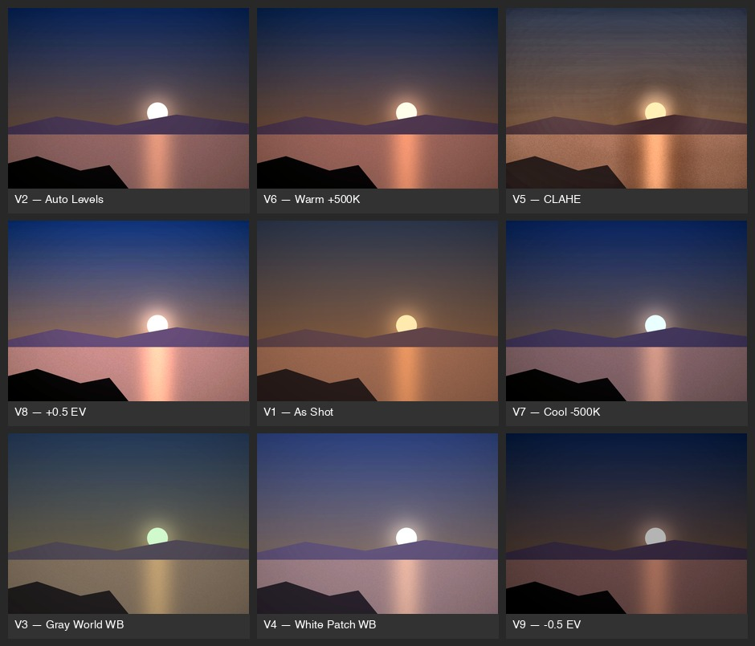

# photolab

The repo is fotomagoufis; the tool it installs is `photolab`.

CLI tool for photo correction and print preparation. Instead of tweaking sliders, photolab generates **correction variants** of your photo, lays them out on a **contact sheet**, then lets you refine and blend the best qualities from multiple variants before preparing the final file for print with ICC color management.



*Output of `photolab correct` on a synthetic test scene — nine variants on one sheet, positions shuffled to defeat position bias when evaluating.*

Built for a workflow with a Fuji X-T1 (RAF), iPhone (HEIC), and Canon PRO-1000 printer, but works with any camera and printer with ICC profiles.

## Quick Start

```bash
git clone https://github.com/dimatosj/fotomagoufis.git
cd fotomagoufis
python -m venv .venv && source .venv/bin/activate
pip install -e ".[dev]"
```

Requires **Python 3.11+**. Prebuilt rawpy wheels cover Python 3.11–3.14 on Linux, Windows, and Apple Silicon macOS; on other platforms (e.g. Intel Macs) pip builds rawpy from source, which needs LibRaw and a C compiler.

## The Workflow

photolab has two ways to go from image to print-ready file:

**Quick path:** `correct` → eyeball the contact sheet → `pick` a variant → print

**Adaptive path:** `correct` → `evaluate` the contact sheet → `refine` with blended recipes → `pick` → print

The adaptive path combines the best qualities from multiple variants (e.g. one variant's skin tones + another's local contrast + highlight protection from a third) instead of forcing you to choose a single one.

### Using with Claude Code

If you're running photolab inside [Claude Code](https://claude.ai/code), you don't need an API key. Just ask Claude to process your photo:

> "Run the full photolab workflow on IMG_4194.HEIC"

Claude can see the contact sheet directly, write the evaluation and prescription, and run the refine step — all without leaving the conversation. This is the easiest way to use the adaptive path.

### Using standalone (with API key)

The `evaluate` CLI command calls the Anthropic API directly for automated/scripted workflows:

```bash
pip install -e ".[evaluate]"    # adds anthropic SDK
export ANTHROPIC_API_KEY=sk-...
photolab correct IMG_4194.HEIC
photolab evaluate corrected/IMG_4194/IMG_4194_contact_sheet.jpg --original IMG_4194.HEIC
photolab refine IMG_4194.HEIC corrected/IMG_4194/IMG_4194_contact_sheet_prescription.json
```

## Commands

### 1. Analyze a photo

```bash
photolab analyze IMG_4373.HEIC
```

```
==================================================
  PHOTOLAB ANALYSIS REPORT
==================================================
  Size          : 3024 x 4032  (3:4)
  Format        : heic  (8-bit)
--------------------------------------------------
  Color Temp    : warm
  Color Cast    : red
  Exposure      : ok  (EV -0.12)
  Dynamic Range : 84.9% utilized
  Shadow Clip   : 0.05%
  Highlight Clip: 0.05%
==================================================
```

Check gamut coverage against a printer profile:

```bash
photolab analyze IMG_4373.HEIC --profile /Library/ColorSync/Profiles/CanonProLuster.icc
```

### 2. Generate correction variants

```bash
photolab correct IMG_4373.HEIC
```

Produces up to 9 full-resolution 16-bit TIFFs in `corrected/IMG_4373/` and a contact sheet JPEG (`IMG_4373_contact_sheet.jpg`). A variant whose correction fails verification is dropped from the sheet — see [Verification](#verification). Variant positions on the contact sheet are shuffled (seeded by filename) to avoid position bias when evaluating.

| # | Variant | What it does |
|---|---------|-------------|
| 1 | As Shot | No changes |
| 2 | Auto Levels | Per-channel histogram stretch |
| 3 | Gray World WB | Neutralize color cast (gray-world algorithm) |
| 4 | White Patch WB | White balance from brightest pixels |
| 5 | CLAHE | Local contrast enhancement (CLAHE: Contrast Limited Adaptive Histogram Equalization) |
| 6 | Warm +500K | Warmer color temperature (based on auto levels) |
| 7 | Cool -500K | Cooler color temperature (based on auto levels) |
| 8 | +0.5 EV | Half stop brighter |
| 9 | -0.5 EV | Half stop darker |

### 3. Compare a subset

After looking at the contact sheet, narrow down to your favorites:

```bash
photolab compare corrected/IMG_4373 2 4 5
```

Generates a new contact sheet with just those variants side by side.

### 4. Evaluate and refine (adaptive correction)

**Evaluate** analyzes the contact sheet and writes a prescription — a set of recipes that blend the best qualities from multiple variants:

```bash
photolab evaluate corrected/IMG_4373/IMG_4373_contact_sheet.jpg --original IMG_4373.HEIC
```

This produces a `_prescription.json` with a diagnostic assessment and 2-3 recipes. Each recipe specifies a base variant plus adjustments (exposure, color temperature, CLAHE, highlight/shadow protection) with per-adjustment strength and tonal zone targeting.

A prescription is plain JSON — you can also write one by hand:

```json
{
  "diagnostic": "Free-text assessment of the variants.",
  "recipes": [
    {
      "recipe_id": "R1",
      "label": "Warm auto levels, protected highlights",
      "description": "Why this blend",
      "base_variant": "v2_auto_levels",
      "adjustments": [
        {"type": "color_temp", "value": 300, "strength": 1.0},
        {"type": "clahe", "strength": 0.5, "zone": "midtones"},
        {"type": "highlight_protection", "threshold": 0.75, "strength": 0.7}
      ]
    }
  ]
}
```

`recipe_id` is `R` plus a number. `base_variant` must be one of `v1_as_shot`, `v2_auto_levels`, `v3_gray_world`, `v4_white_patch`, `v5_clahe`, `v6_warm`, `v7_cool`, `v8_plus_half_ev`, `v9_minus_half_ev`. Adjustment `type` is one of `exposure` (`value` = EV shift), `color_temp` (`value` = kelvin delta), `auto_levels`, `gray_world`, `white_patch`, `clahe`, `highlight_protection`, or `shadow_protection` (the protections take `threshold`, a 0-1 luminance cutoff). `strength` (0-1) blends the adjustment against the unadjusted image, and an optional `"zone"` of `"shadows"`, `"midtones"`, or `"highlights"` limits it to that tonal range.

**Refine** applies those recipes to generate new blended variants:

```bash
photolab refine IMG_4373.HEIC corrected/IMG_4373/IMG_4373_contact_sheet_prescription.json
```

Outputs refined TIFFs and a refined contact sheet. Recipes always start from the original image (base variant + adjustments), never from a previous refine round — so you can iterate safely: evaluate the refined sheet, adjust the recipe values, refine again. A recipe naming anything other than v1-v9 as its base (e.g. a refined `R1`) is rejected with an error rather than silently reinterpreted.

### 5. Pick a variant and print

```bash
photolab pick corrected/IMG_4373/IMG_4373_R3.tiff --paper glossy
```

This applies:
- ICC color space conversion (perceptual or relative-colorimetric intent)
- Print sharpening tuned for paper type (glossy, matte, or fine art)
- Outputs a 16-bit TIFF with embedded ICC profile for the printer, and a JPEG proof for screen

If the input file carries an embedded ICC profile, it is used as the conversion source; otherwise sRGB is assumed. The conversion itself runs through a littleCMS transform sampled on a color lattice and interpolated in 16-bit space, so smooth gradients survive into the print file instead of being quantized to 8 bits.

### 6. Batch process a folder

```bash
photolab batch ./vacation-photos/
```

Runs `correct` on every image in the directory. Generates per-image contact sheets plus a master index sheet.

## Verification

photolab doesn't trust that an adjustment worked — it measures the pixels afterward. Every adjustment type has a validator that knows what success looks like: a warm shift must move the red channel in proportion to the requested kelvin and strength, an EV shift must move mean luminance, CLAHE must increase local contrast, auto levels must widen the histogram, and the protections must measurably restore the protected tonal zone toward the recipe's base — a protection that changes nothing fails. Zone-targeted adjustments are measured only inside their zone.

`correct` and `refine` print one line per check:

```
  ✓ color_temp: red shift 3.1% (min 1.6% for 200K @ strength 1)
  ✗ exposure: luminance change 0.8% (min 8.0% for 0.50 EV)
```

What happens on failure depends on the command. In `refine`, a failed adjustment gets exactly one retry with amplified parameters — doubled value for exposure/color_temp, doubled strength (capped at 1.0) for the strength-based types; protection adjustments are never retried. If the retry still fails, the whole recipe is skipped and reported in the summary. In `correct`, only the value-based variants (Warm, Cool, ±0.5 EV) get an amplified retry; the others (Auto Levels, Gray World, White Patch, CLAHE) are already applied at full strength, so there is nothing to amplify — if they fail, the variant is dropped from the contact sheet immediately. Either way, a correction that measurably did nothing is discarded rather than shipped, which is why a sheet can have fewer than 9 cells.

## Supported Formats

**Input:** JPEG, PNG, TIFF, HEIF/HEIC, and RAW formats (RAF, CR2, NEF, ARW, DNG, ORF — anything LibRaw handles).

**Output:** 16-bit TIFF for print files, JPEG for contact sheets and proofs.

## Configuration

On first run, photolab scans for ICC profiles and generates a config at `~/.photolab/config.toml`. It looks in platform-appropriate directories:

- **macOS:** `/Library/ColorSync/Profiles/`, `/Library/Printers/`, `~/Library/ColorSync/Profiles/`
- **Linux:** `/usr/share/color/icc/`, `/usr/local/share/color/icc/`, `~/.local/share/color/icc/`
- **Windows:** `%WINDIR%\System32\spool\drivers\color`

Profiles are classified by paper type keywords in the filename (luster/glossy, matte, fine art/rag/baryta). You can edit the config to map profile aliases:

```toml
[defaults]
dpi = 300
paper = "matte"
intent = "perceptual"

[profiles.glossy]
path = "/Library/ColorSync/Profiles/CanonProLuster.icc"
type = "glossy"

[profiles.matte]
path = "/Library/ColorSync/Profiles/CanonProPremiumMatte.icc"
type = "matte"

[profiles.fine_art]
path = "/Library/ColorSync/Profiles/CanonProPhotoRag.icc"
type = "fine_art"
```

The `type` field controls print sharpening — glossy gets lighter sharpening, fine art gets heavier sharpening to compensate for ink spread on textured paper.

## Development

```bash
pip install -e ".[dev]"
python -m pytest tests/ -v
```

225 tests using synthetic images — no real photos in the repo.

## License

MIT
